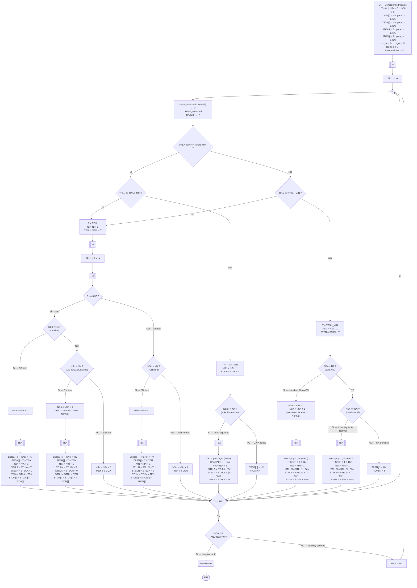
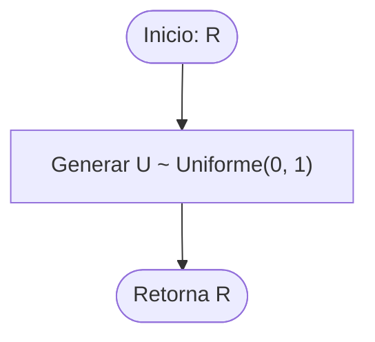
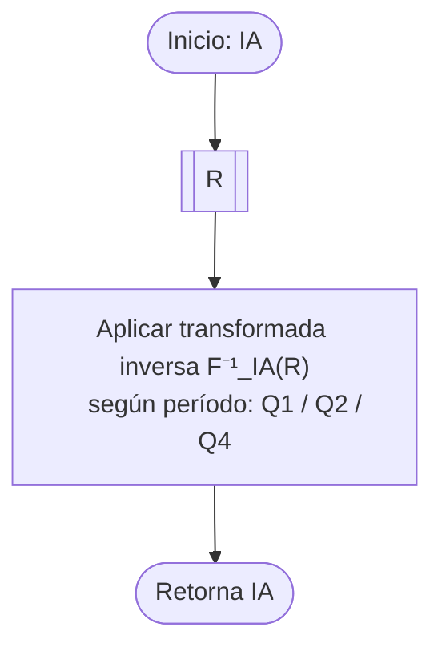
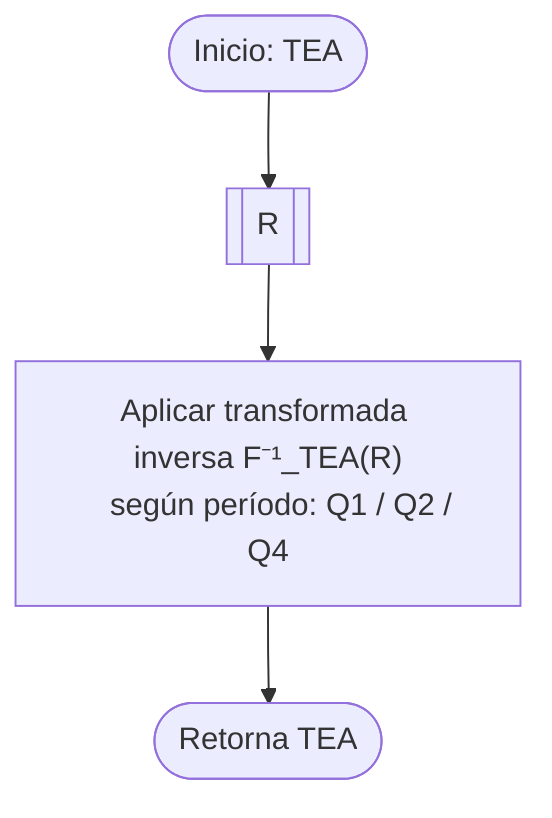
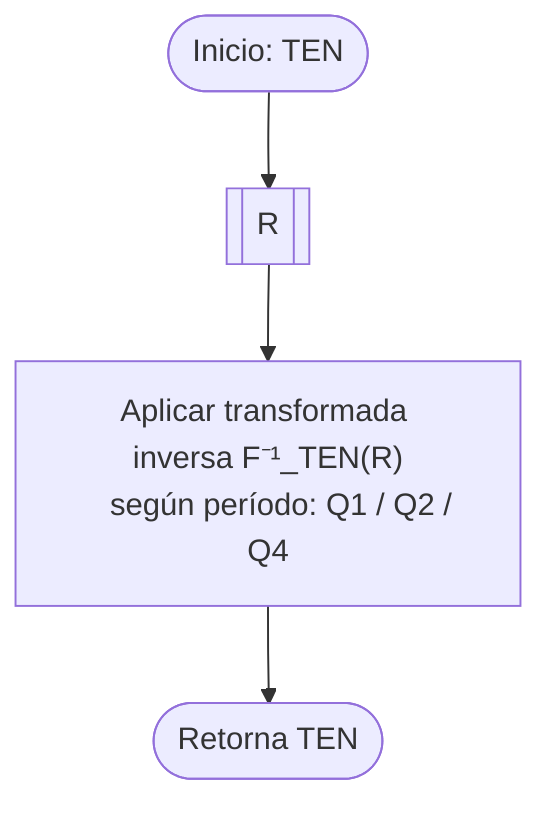
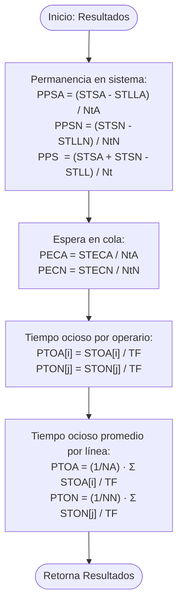

# Diagrama de Flujo del Modelo de Simulación

Documenta la lógica evento-a-evento implementada en `simulacion.py`.

---

## ⚠️ Convención del modelo (incluida como disclaimer en el TP)

Todas las métricas por prioridad (`PPSA`, `PPSN`, `PECA`, `PECN`) se computan **por línea de atención**, no por prioridad original del pedido. Es decir:

- **PPSA / PECA** miden el desempeño de la **línea CA** (pedidos atendidos por operarios Alta).
- **PPSN / PECN** miden el desempeño de la **línea CN** (pedidos atendidos por operarios Normal, **incluyendo los pedidos Alta transferidos por preferencia de cola**).

Esto se debe a que, cuando un pedido Alta es absorbido por un operario CN, su tiempo de atención corresponde al de la línea Normal (TEN), y a partir de ese momento se contabiliza dentro de las métricas de la línea Normal. Esta convención mantiene el modelo internamente consistente y refleja el rendimiento real de cada línea de procesamiento.

---

## Convenciones del modelo

- **NSa** = pedidos Alta en cola Alta + pedidos Alta siendo atendidos por **CA**
- **NSn** = pedidos en cola Normal + pedidos siendo atendidos por **CN** (de cualquier origen)
- Si un Alta es atendido por CN, **deja de contarse en NSa y pasa a NSn**, y se le aplica **TEN**.
- Las colas (CQA, CQN) son FIFO y guardan el **tiempo de arribo** de cada pedido para poder calcular tiempo de espera al asignarse a un operario.

---

## Diagrama principal

---

## Subrutina: R — Número aleatorio uniforme

## Subrutina: IA — Intervalo entre arribos

## Subrutina: TEA — Tiempo de atención CA (línea Alta)

## Subrutina: TEN — Tiempo de atención CN (línea Normal)

> Se usa **siempre que CN atienda un pedido**, sea de origen Alta o Normal.

---

## Subrutina: Resultados

---

## Glosario de variables

### Entradas exógenas

| Variable | Tipo | Descripción |
|----------|------|-------------|
| **IA** | Dato | Intervalo entre arribos |
| **TEA** | Dato | Tiempo de atención de un operario **CA** |
| **TEN** | Dato | Tiempo de atención de un operario **CN** (sea pedido Alta o Normal) |
| **R** | Dato | Número aleatorio uniforme U(0,1) |

### Variables de control

| Variable | Descripción |
|----------|-------------|
| **NA** | Cantidad de operarios CA |
| **NN** | Cantidad de operarios CN |
| **TF** | Tiempo final de la simulación |

### Estado

| Variable | Descripción |
|----------|-------------|
| **T** | Reloj de la simulación |
| **NSa** | Pedidos Alta en cola Alta + atendidos en CA |
| **NSn** | Pedidos en cola Normal + atendidos en CN (cualquier origen) |
| **CQA** | Cola FIFO de tiempos de arribo de pedidos Alta esperando |
| **CQN** | Cola FIFO de tiempos de arribo de pedidos Normal esperando |

### TEF

| Variable | Descripción |
|----------|-------------|
| **TPLL** | Tiempo de la próxima llegada |
| **TPSA[i]** | Próxima salida del CA i |
| **TPSN[j]** | Próxima salida del CN j |
| **TPSA_MIN / i\*** | Mínimo de TPSA[i] e índice ganador |
| **TPSN_MIN / j\*** | Mínimo de TPSN[j] e índice ganador |
| **HV** | Valor muy alto (∞) — servidor ocioso |

### Acumuladores

| Variable | Descripción |
|----------|-------------|
| **Nt** | Total de pedidos llegados al sistema |
| **NtA** | Pedidos atendidos por la **línea CA** (incrementa al asignar a un CA) |
| **NtN** | Pedidos atendidos por la **línea CN** (incrementa al asignar a un CN, incluye Altas transferidos) |
| **STLL** | Suma de tiempos de llegada (todos los pedidos) |
| **STLLA** | Suma de tiempos de llegada de pedidos atendidos por CA |
| **STLLN** | Suma de tiempos de llegada de pedidos atendidos por CN |
| **STSA / STSN** | Suma de tiempos de salida en línea CA / CN |
| **STAA / STNN** | Suma de tiempos de atención CA / CN |
| **STECA / STECN** | Suma de tiempos de espera en cola para pedidos servidos por CA / CN |
| **STOA[i] / STON[j]** | Suma de tiempo ocioso por operario |
| **ITOA[i] / ITON[j]** | Inicio del último tramo ocioso por operario |

> Nota: por construcción, `Nt = NtA + NtN` y `STLL = STLLA + STLLN` al finalizar la simulación.

### Resultados

| Variable | Descripción |
|----------|-------------|
| **PPSA / PPSN / PPS** | Promedio de permanencia en el sistema (línea CA / línea CN / total) |
| **PECA / PECN** | Promedio de espera en cola (línea CA / línea CN) |
| **PTOA[i] / PTON[j]** | % de tiempo ocioso por operario |
| **PTOA / PTON** | % de tiempo ocioso promedio por línea |

